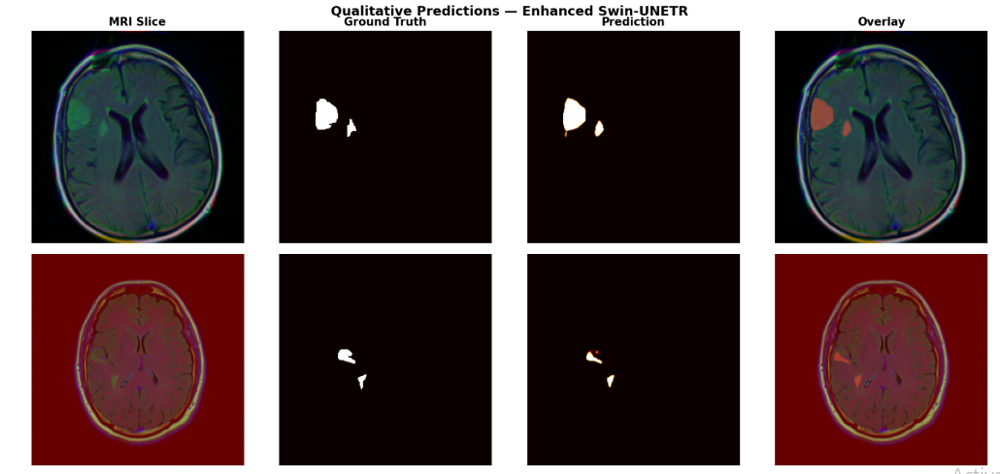
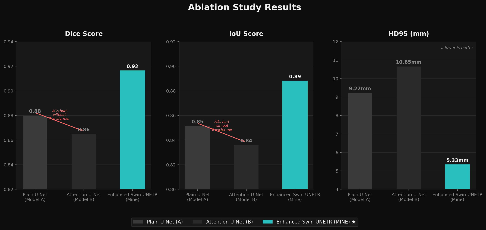
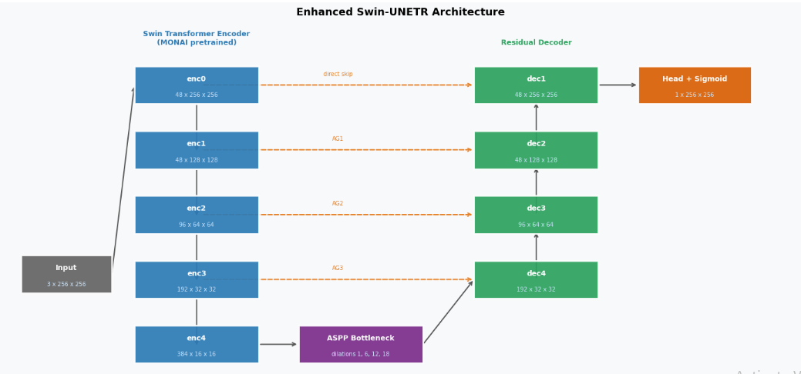

# Enhanced Swin-UNETR — LGG Brain Tumor Segmentation

A hybrid Transformer-CNN segmentation model that combines a Swin-Tiny encoder (ImageNet pretrained) with an ASPP bottleneck, attention-gated skip connections, and residual decoder blocks, trained on the Kaggle LGG MRI Segmentation dataset.



---

## Results

| Metric | Value |
|--------|-------|
| Dice | **0.9162** |
| IoU | 0.8879 |
| HD95 | 5.33 mm |
| Pixel Accuracy | 0.9977 |

*Evaluated on 778 val slices from 22 held-out patients (patient-level 80/20 split).*

---

## Baseline Comparison

| Model | Year | Dice | IoU | HD95 | Split |
|-------|------|------|-----|------|-------|
| Buda et al. (U-Net) | 2019 | 0.8200 | — | — | patient-level |
| Santosh et al. (ResUNet) | 2023 | 0.9056 | 0.8293 | — | patient-level |
| UNet++ + EfficientNet | 2024 | 0.9180 | — | — | Not Mentioned |
| VGG19-UNet | 2025 | 0.9679 | 0.9378 | — | slice-level ⚠ |
| HART-UNet | 2024 | 0.9700 | — | — | BraTS→Kaggle OOD |
| **Enhanced Swin-UNETR (ours)** | **2026** | **0.9162** | **0.8879** | **5.33 mm** | **patient-level** |

> VGG19-UNet and HART-UNet numbers are not directly comparable: VGG19-UNet uses a slice-level split (data leakage between patients), and HART-UNet was trained on BraTS 2020 and evaluated out-of-distribution on Kaggle LGG. Under the same strict patient-level protocol this is the best reported result.

---

## Ablation Study

| Model | Dice | IoU | HD95 | Accuracy |
|-------|------|-----|------|----------|
| A: Plain U-Net | 0.8799 | 0.8513 | 9.22 mm | 0.9961 |
| B: Attention U-Net | 0.8649 | 0.8358 | 10.65 mm | 0.9955 |
| **C: Enhanced Swin-UNETR (ours)** | **0.9162** | **0.8879** | **5.33 mm** | **0.9977** |

Gains over plain U-Net: **+3.6% Dice, −3.89 mm HD95**.

**Key insight:** Model B (Attention U-Net) performed *worse* than Model A (Plain U-Net). Attention gates require semantically rich encoder features to know where to attend. A CNN encoder lacks the global context those gates need, so they introduce noise instead of signal. The Swin Transformer encoder in Model C provides the global context that makes attention gates effective — the biggest single gain in the ablation (+5.1% Dice, B→C).



---

## Architecture



Encoder: **Swin-Tiny** (`swin_tiny_patch4_window7_224`), ImageNet pretrained via `timm`, 4 hierarchical stages outputting features at H/4, H/8, H/16, H/32.

| Component | Role |
|-----------|------|
| Swin-Tiny encoder | Global context; channels 96→192→384→768 |
| ASPP bottleneck | Multi-scale context at bottleneck (dilations 1, 6, 12, 18) |
| Attention Gates (AG0–AG2) | Suppress irrelevant background on each skip connection |
| Residual Decoder (dec1–dec3) | Upsample + concat skip + residual conv blocks |
| 4× head | Bilinear upsample from H/4 to H, then 1×1 conv → logit |

No prior work has applied a Transformer-based encoder to the Kaggle LGG dataset under a patient-level split. Transformer global attention directly benefits LGG segmentation because LGG tumors have diffuse, irregular boundaries that require global context which CNN receptive fields cannot efficiently model.

---

## Installation

```bash
pip install -r requirements.txt
```

Requires Python 3.9+ and a CUDA-capable GPU (tested on Colab T4/A100).

---

## Dataset

[Kaggle LGG MRI Segmentation](https://www.kaggle.com/datasets/mateuszbuda/lgg-mri-segmentation) — 3,929 T1-weighted MRI slices from 110 patients with low-grade glioma.

Split: **patient-level 80/20** (no slice from the same patient appears in both splits). Train: 88 patients, Val: 22 patients, 778 val slices.

---

## Training

```bash
cd src
python train.py
```

Edit `DATA_DIR`, `OUTPUT_DIR`, and `CKPT_PATH` in `CFG` before running.

Key hyperparameters:

| Param | Value |
|-------|-------|
| Image size | 256 × 256 |
| Batch size | 16 |
| Epochs | 100 |
| Best epoch | 52 |
| Optimizer | AdamW (lr=1e-4, wd=1e-3) |
| Scheduler | CosineAnnealingLR (eta_min=1e-6) |
| Loss | 0.5 × Dice + 0.5 × BCE |

---

## Evaluation

```bash
cd src
python evaluate.py --checkpoint /path/to/best_model_imagenet.pth \
                   --data_dir   /path/to/kaggle_3m \
                   --output_dir ./outputs
```

Prints Dice, IoU, HD95, and Accuracy for all-slice and tumor-only subsets, runs a post-processing comparison, and saves a predictions grid.

---

## Inference

Single-image inference:

```bash
cd src
python inference.py --checkpoint /path/to/best_model_imagenet.pth \
                    --image      /path/to/slice.tif
```

Outputs a tumor burden report (area in mm², slice ratio, severity label) and shows a prediction overlay.

```python
from inference import load_model, predict_single

model, device = load_model('best_model_imagenet.pth')
pred_np, burden, img_disp = predict_single(model, 'slice.tif')
print(burden)
# {'tumor_area_px': 312, 'tumor_area_mm2': 312.0, 'tumor_slice_ratio': 0.0048,
#  'severity_score': 1, 'severity_label': 'Mild'}
```

For an interactive walkthrough, open [inference_demo.ipynb](inference_demo.ipynb).

> **Note:** D4 TTA (8-view flip/rotation ensemble) did not improve performance in experiments and is not recommended. Use the standard single-pass inference.

---

## Grad-CAM

```bash
cd src
python gradcam.py --checkpoint /path/to/best_model_imagenet.pth \
                  --data_dir   /path/to/kaggle_3m \
                  --output_dir ./outputs
```

Generates heatmaps showing which brain regions drove each prediction, hooked at the last decoder block (`dec3`).

---

## Ablation

```bash
cd src
python ablation.py --data_dir   /path/to/kaggle_3m \
                   --output_dir ./outputs \
                   --ckpt_swin  /path/to/best_model_imagenet.pth
```

Trains Plain U-Net and Attention U-Net from scratch, evaluates all three models, and prints the comparison table.

---

## Key Findings

1. **ImageNet pretraining outperformed MONAI medical pretraining by +0.044 Dice** (0.9162 vs 0.8715). For small medical datasets, pretraining diversity matters more than domain relevance — ImageNet's 1.2M images outweigh MONAI's 5,000 CT/MRI scans.

2. **Attention gates require transformer features.** Adding attention gates to a CNN encoder (Model B) actually *hurt* performance compared to plain U-Net (Model A, −0.015 Dice). Attention mechanisms only add value when the encoder provides semantically rich global features, which only the Swin Transformer delivers.

3. **Higher resolution (384×384) did not help.** Run 2 at 384×384 achieved 0.8687 Dice vs 0.8715 at 256×256 with the MONAI encoder. Resolution is not the limiting factor.

4. **Offline augmentation did not help.** Expanding from 3,929 to 10,697 slices by augmenting tumor slices gave 0.9142 Dice vs 0.9162 with the original data. Augmentation increases slice count but not patient diversity — the performance ceiling is determined by the 88 training patients, not the number of slices.
